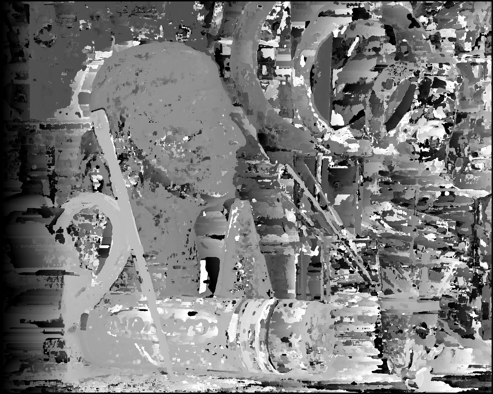
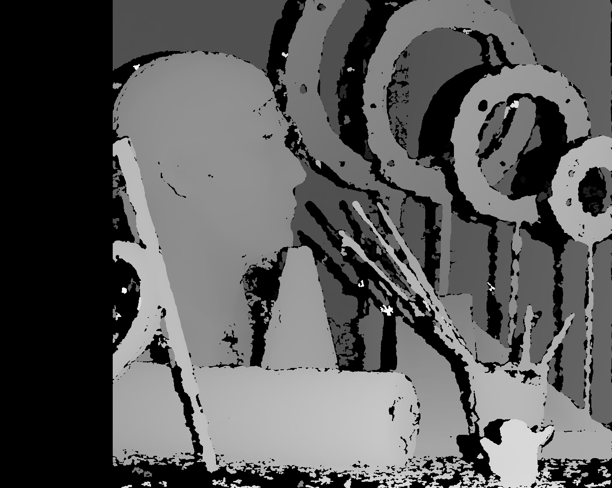
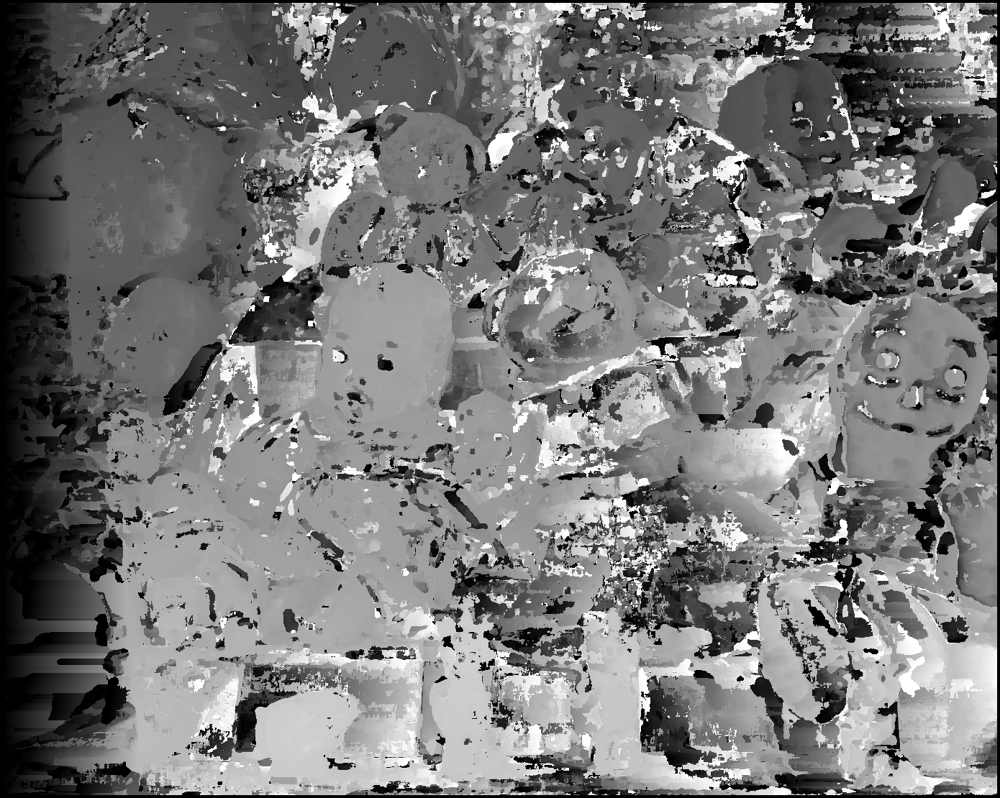
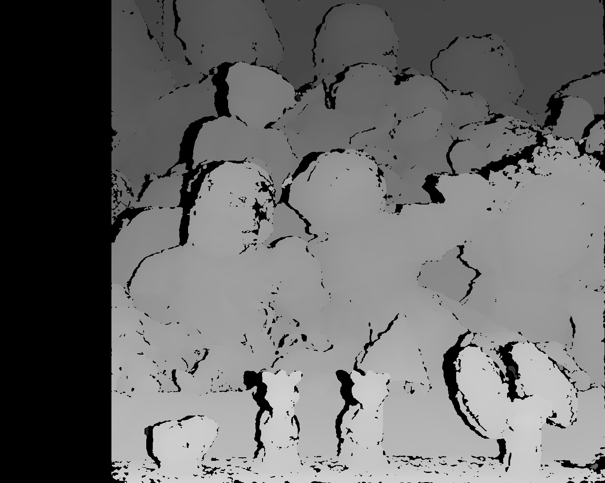
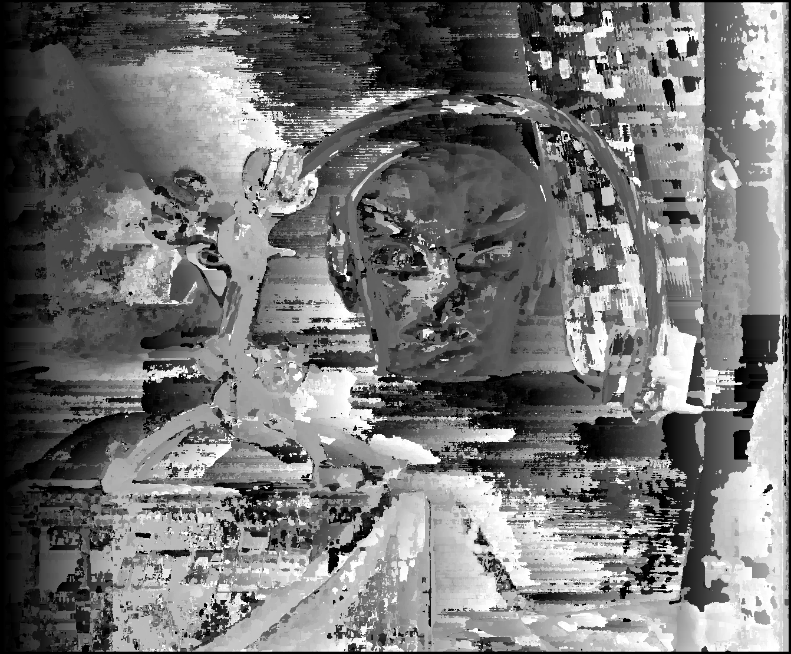
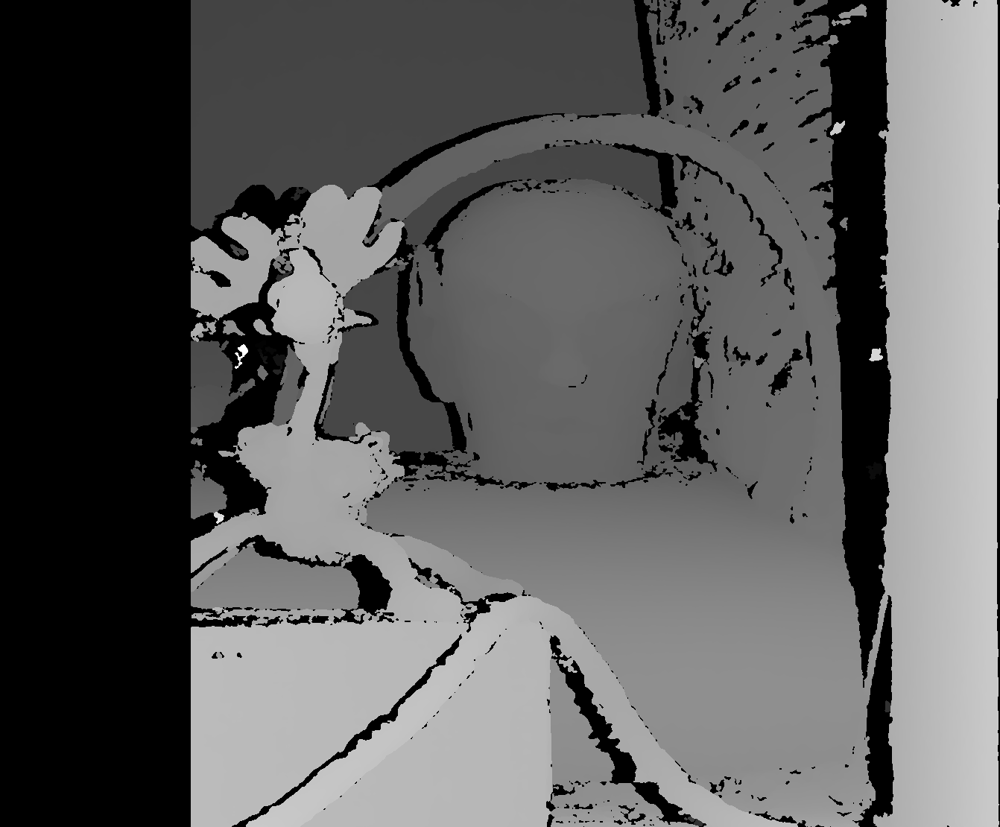

# 📸 Stereo Matching for Disparity Maps

## 🌟 Overview
This repository implements and compares multiple stereo matching techniques to generate disparity maps from stereo image pairs. The methods include:

1. **Traditional Window-Based Matching (Block Matching)**
2. **OpenCV Stereo Semi-Global Block Matching (StereoSGBM)**
3. **Pyramid Stereo Matching Network (PSMNet)**

The project also evaluates the **Peak Signal-to-Noise Ratio (PSNR)** between generated disparity maps and ground-truth disparity maps to assess the accuracy of the methods.

---

## 🛠 Features
- **Traditional Block Matching**: A window-based matching approach implemented from scratch.
- **StereoSGBM**: Advanced stereo matching using OpenCV's Semi-Global Block Matching algorithm.
- **PSMNet**: A deep learning-based stereo matching method using a pre-trained Pyramid Stereo Matching Network.
- **Disparity Map Evaluation**: Quantitative evaluation using PSNR.

---

## 📦 Dependencies
The project requires the following libraries:
- Python 3.x
- OpenCV
- NumPy
- tqdm
- PIL (Python Imaging Library)
- PyTorch (for PSMNet)
- CUDA (for GPU-based PSMNet operations)

---

## 📊 Methods

### 1. Traditional Window-Based Matching
- Matches a small window of pixels between left and right images.
- Implementation:
  - Sum of Absolute Differences (SAD) as the cost metric.
  - Adjustable window size and maximum disparity.

### 2. OpenCV StereoSGBM
- Uses OpenCV's `StereoSGBM_create` for semi-global matching.
- Parameters are tuned for better accuracy.

### 3. PSMNet
- A deep learning-based stereo matching method.
- Pre-trained on the Scene Flow dataset.
- Requires resizing images for limited GPU memory.

---

## 🏆 Results

### Disparity Maps
Below is a comparison of reconstructed disparity maps for the "Art" stereo image pair:

| **Ground Truth**             | **Window-Based Matching**           | **StereoSGBM**                  | **PSMNet**                     |
|-------------------------------|-------------------------------------|----------------------------------|---------------------------------|
|  |  |  |  |

Below is a comparison of reconstructed disparity maps for the "Dolls" stereo image pair:

| **Ground Truth**             | **Window-Based Matching**           | **StereoSGBM**                  | **PSMNet**                     |
|-------------------------------|-------------------------------------|----------------------------------|---------------------------------|
|  |  |  |  |

Below is a comparison of reconstructed disparity maps for the "Reindeer" stereo image pair:

| **Ground Truth**             | **Window-Based Matching**           | **StereoSGBM**                  | **PSMNet**                     |
|-------------------------------|-------------------------------------|----------------------------------|---------------------------------|
|  |  |  |  |

### PSNR Values
| **Method**                | **Art** | **Dolls** | **Reindeer** |
|---------------------------|---------|-----------|--------------|
| **Window-Based Matching** | 12.41   | 12.15     | 10.84        |
| **StereoSGBM**            | 12.67   | 16.15     | 15.58        |
| **PSMNet (Resized 70%)**  | 15.79   | 15.26     | 15.95        |

---

## 📚 References
- **SGBM**: Hirschmüller, Heiko. "Accurate and efficient stereo processing by semi-global matching and mutual information." *CVPR 2005*.
- **PSMNet**: Chang, Jia-Ren, and Yong-Sheng Chen. "Pyramid stereo matching network." *CVPR 2018*.
- **Scene Flow Dataset**: Mayer, N., et al. "A large dataset to train convolutional networks for disparity, optical flow, and scene flow estimation." *CVPR 2016*.
